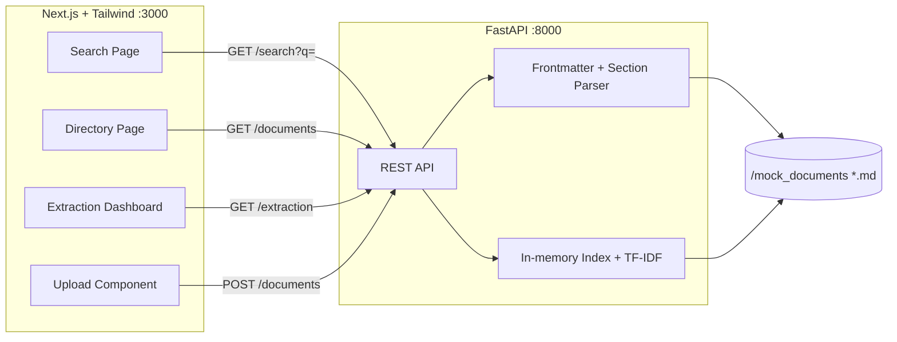

# GovSOP AI — Design

## Overview
GovSOP AI is a local-first, two-process web application. A FastAPI backend parses markdown documents in `/mock_documents`, builds an in-memory index, and serves REST endpoints for search, directory, extraction, and upload. A Next.js + Tailwind frontend provides a three-view command-center SPA (Search, Directory, Dashboard) with a drag-and-drop upload.

## Architecture

## High-Level Solution
The backend loads and parses all markdown in `/mock_documents` at startup into an in-memory index:
- Per-document metadata and extraction fields from YAML frontmatter.
- Per-section chunks (split by markdown headings) for TF-IDF search.

REST endpoints expose:
- **search** — ranked sections + citations.
- **documents** — directory with derived badges.
- **extraction** — aggregated cards.
- **upload** — write file + re-index.

The frontend is a three-view SPA sharing a command-center layout and a typed API client, styled dense/dark with Tailwind.

## Backend Design

### Tech & Dependencies (fully offline)
- `fastapi`, `uvicorn`
- `python-frontmatter` (or `PyYAML`) for frontmatter parsing
- TF-IDF via Python stdlib (`collections`, `math`); `scikit-learn` acceptable alternative
- `pytest` for tests

### Data Models (Pydantic)
- `Deadline { label: str, date: date, doc_id: str }`
- `Section { section_title: str, text: str, order: int }`
- `Document { doc_id, title, department, effective_date, review_status, action_items[], deadlines[], responsible_departments[], policy_changes[], sections[] }`
- `Badge { label: str, severity: "warning" | "none" }`

### Parser
- Reads a markdown file, splits frontmatter from body.
- Validates required frontmatter fields; raises a clear error on malformed input.
- Splits body on `#`/`##` headings into ordered `Section` chunks.

### IndexService
- `load()` scans `/mock_documents`, parses each file, logs skipped/invalid files without crashing.
- Holds `documents` and a flat `sections` list.
- Builds TF-IDF representation over section texts.
- `reload()` re-scans after upload.

### Badge Mapping
- `needs_review` → "⚠️ Needs Review" (warning)
- `outdated_clause` → "Outdated Clause" (warning)
- `current` → none / "Current"

### REST Endpoints
- `GET /health` → `{ status: "ok" }`
- `GET /documents?department=` → list of documents with metadata + derived `badges`
- `GET /search?q=` → `{ answer, results: [{ doc_id, section_title, snippet, score, order }] }`; empty result on zero match
- `GET /extraction` → aggregated `{ action_items[], deadlines[], responsible_departments[], policy_changes[] }` with source refs
- `GET /extraction/{doc_id}` → per-document extraction
- `POST /documents` → upload `.md`, validate, write, re-index; 201 on success, 400 on invalid

### Search Algorithm
- Tokenize lowercased text; strip stopwords/punctuation.
- Compute TF-IDF over section chunks; rank sections by query relevance.
- Return top-N sections with snippet, score, and citation `{doc_id, section_title, order}`.
- Assemble a simple "answer" from the top snippet(s).

## Frontend Design

### Stack
- Next.js (App Router) + React + Tailwind CSS.
- Dark, high-density command-center theme.
- Typed API client in `lib/api.ts` reading `NEXT_PUBLIC_API_BASE`.

### Layout
- Shared layout with sidebar nav: Search / Directory / Dashboard.
- Reusable `Badge` component for compliance alerts.

### Views
- **Search:** query input (debounced), answer summary, results list with citation chips; loading/empty/error states.
- **Directory:** grid/table with Department, Effective Date, badges; department filter; document detail drawer showing sections.
- **Dashboard:** four card sections (Action Items, Deadlines sorted by date, Responsible Departments, Key Policy Changes); each item links to source.
- **Upload:** drag-and-drop posting to `POST /documents`; progress, success toast, validation errors; refetch views on success.

## Local Run
- FastAPI on :8000, Next.js on :3000.
- Root README + root script (e.g. npm script using `concurrently`, or documented two-terminal PowerShell steps).
- Frontend reaches backend via `NEXT_PUBLIC_API_BASE` (default `http://localhost:8000`).

## Verification Strategy
- Backend: pytest per task before moving on.
- Frontend: build/test as applicable per task.
- Clean up temporary files created during verification.
- Windows / PowerShell-compatible commands.
